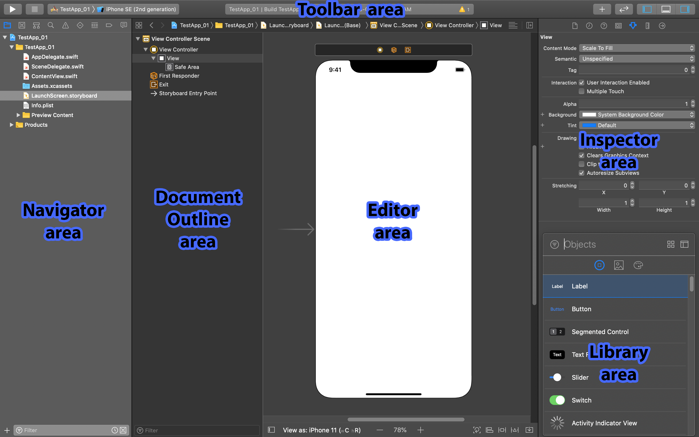
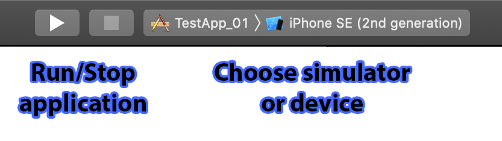
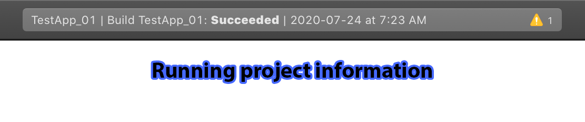
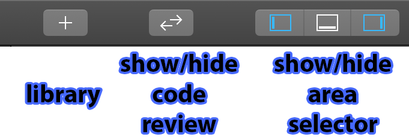
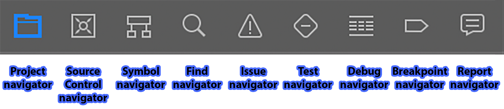
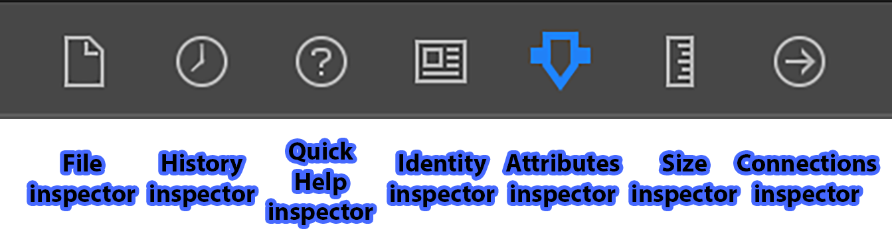
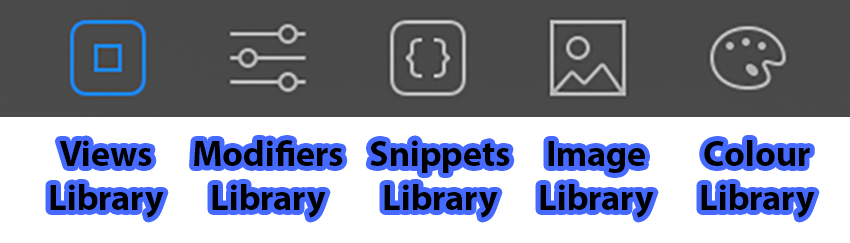
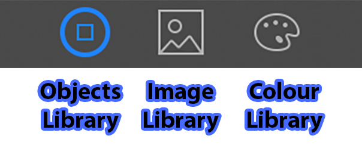
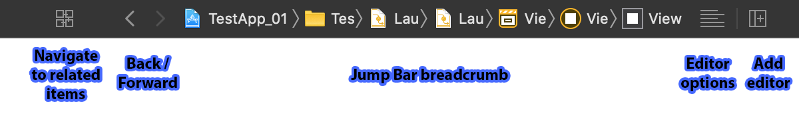

# 🧠 Basic tour of Xcode

## The Main Areas Within Xcode

The following images highlight _some_ of the more important areas and buttons of the Xcode interface.

## The Toolbar Area

::: warning Note
If you do not see the toolbar area in Xcode, go to **View -> Show Toolbar** (**⌥⌘T**).
:::

## The Navigator Area

## The Inspector Area

## The Library Area

## The Jump Bar in The Editor Area

