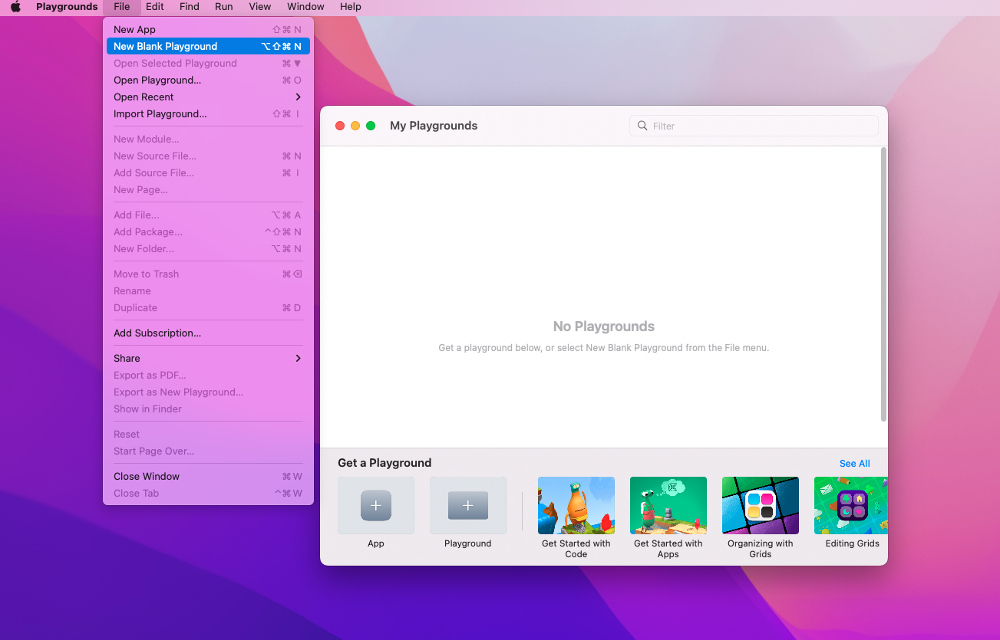
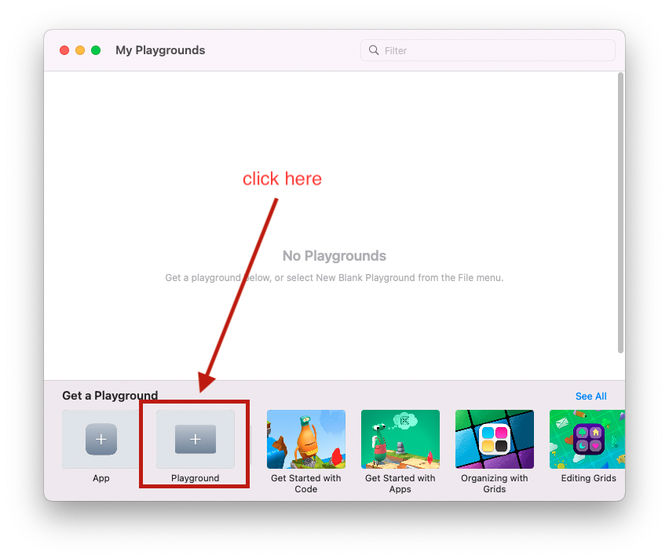

# 🧠 Creating Playgrounds

Creating playgrounds in Xcode and Swift Playgrounds is an easy task.

::: warning Remember
Exercise 1 requires you to create playgrounds and output your name in the console!
:::

## Create Playgrounds in Xcode

<YouTube

  title="the title for the embedded youtube video"
  url="https://www.youtube.com/embed/dgWVUH0WXmI"

/>

## Swift Playgrounds

From the application menu: Select **File->New Blank Playground**

**or** select **'Playground'** from **'Get a Playground'**

## See Also

- [Getting the Most out of Playgrounds in Xcode - WWDC18 - Videos - Apple Developer](https://developer.apple.com/videos/play/wwdc2018/402/)
- [Explore Packages and Projects with Xcode Playgrounds - WWDC20 - Videos - Apple Developer](https://developer.apple.com/videos/play/wwdc2020/10096/)
