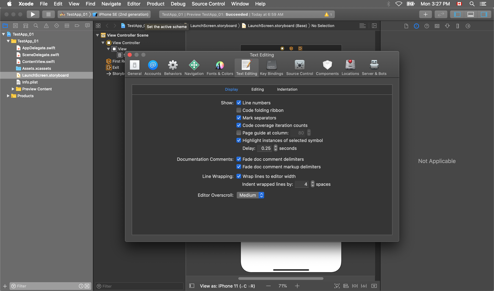

# 🧠 Customizing Xcode

## Displaying line numbers

By default, Xcode does not display line numbers.

To turn on this functionality, go to **Xcode -> Preferences**, and open the _Text Editing_ tab.

Check the box for _Line numbers_, and close the window.

## Fonts and colours

In the **Fonts & Colors** tab in the _Preferences_, you can change the fonts and the colour scheme of the text editor.
