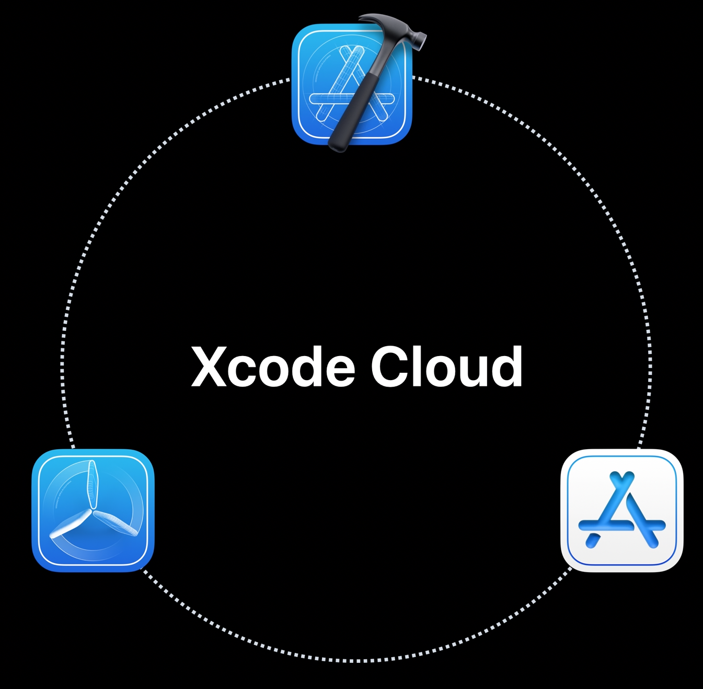
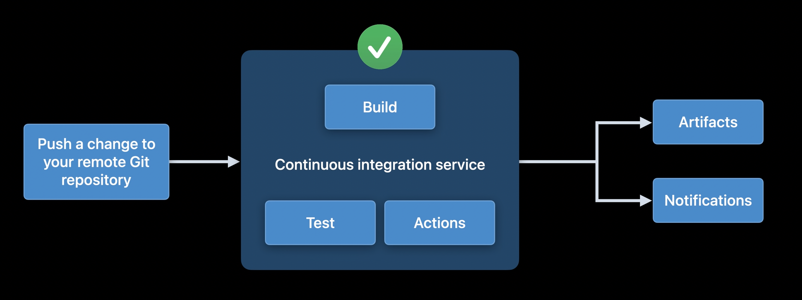

# 🧠 Xcode Cloud

## Overview

Xcode Cloud is a continuous integration and delivery toolset designed exclusively for Apple developers. It integrates with Xcode and provides a set of build, test and release features that accelerates the build process.

## Xcode Cloud integration

## Xcode Cloud workflow

## Meet Xcode Cloud

## Get the most out of Xcode Cloud

## See Also

- [About continuous integration and delivery with Xcode Cloud - Apple Developer Documentation](https://developer.apple.com/documentation/xcode/about-continuous-integration-and-delivery-with-xcode-cloud)
- [DevOps - Wikipedia](https://en.wikipedia.org/wiki/DevOps)
- [What is Continuous Integration | Atlassian](https://www.atlassian.com/continuous-delivery/continuous-integration)
- [Continuous integration vs. delivery vs. deployment | Atlassian](https://www.atlassian.com/continuous-delivery/principles/continuous-integration-vs-delivery-vs-deployment)