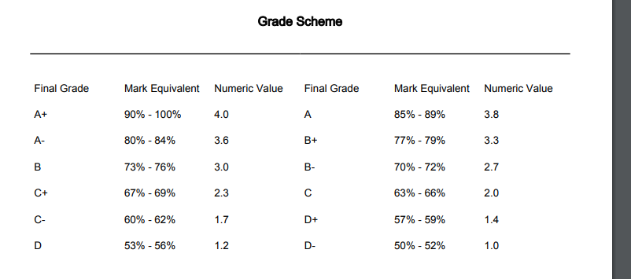

# 😵‍💫 Exercise 11

Create a function called getGrade that takes an Integer parameter used to pass a students numeric mark from an assignment. The mark will be between 0 - 100. The function should return the correct grade letter value for the passed student mark. The returned value should be a String.

Use a for in loop to test your function. The loop should start at 49 and end above 100 so that you can test a mark over 100 once to view the error message. Use the loop to test all possible value ranges without testing every possible mark value. (Hint: you should use a stride function so you can increment by more than 1)

::: danger Warning
This is a practice exercise.  
**Do not submit for grading**
:::
