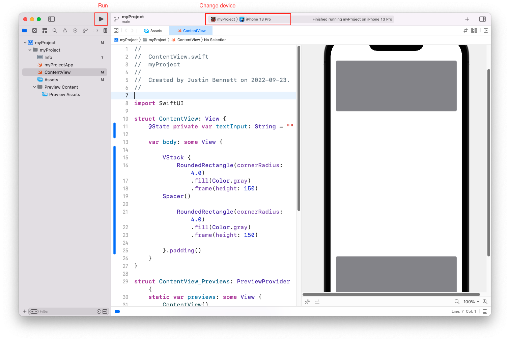

# 🧠 Simulator

Use Simulator to rapidly prototype and test builds of your app during the development process. Installed as part of the Xcode tools, Simulator runs on your Mac and behaves like a standard Mac app while simulating iPhone, iPad, Apple Watch, or Apple TV environments. Each combination of a simulated device and software version is considered its own simulation environment, independent of the others, with its own settings and files. These settings and files exist on every device you test within a simulation environment. Open multiple simulated devices for interactions such as an iPhone and a paired Apple watch.

## Running

Simulator is generally spun up from Xcode when you run a project.You can also access the Simulator from the menu: Xcode > Open Developer Tool > Simulator

## Resizing

- Physical device size: Window > Physical size
- Same scale factor as physical device: Window > Point accurate
- Same pixel count as physical device: Window > Pixel accurate

To manually adjust the size of the window, hover over a corner of the simulator window and drag the window to the desired size.

## Interacting with iOS

You can mimic or recreate most real-world gestures and scenarios in Simulator. See the help documentation included with Simulator for full details.

## Screenshots and Recordings

Simulator is equipped to capture screenshots and recordings of interaction with a simulated device. To capture a screenshot select **File > Save Screen** from the menu or **⌘S**. To capture a screen recording select **File > Record Screen** or **⌘R**.
