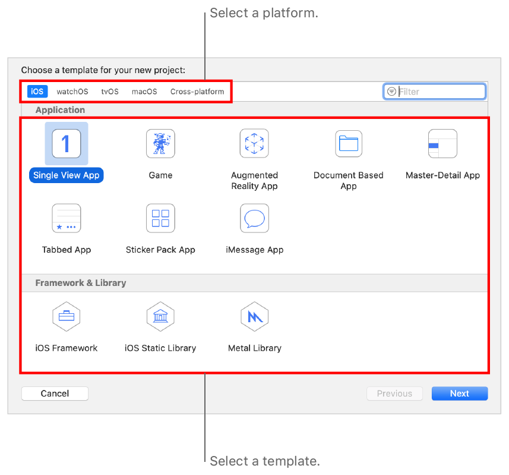
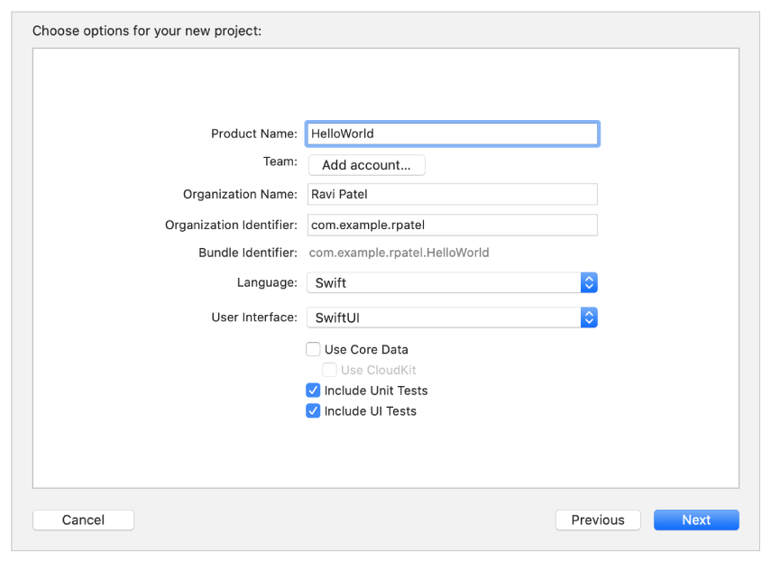
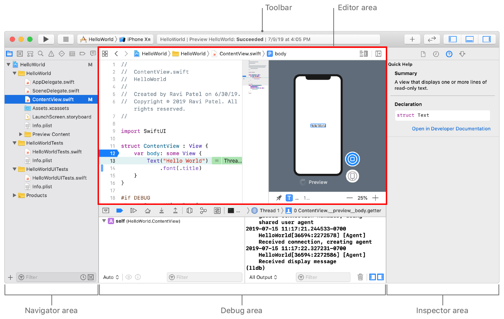
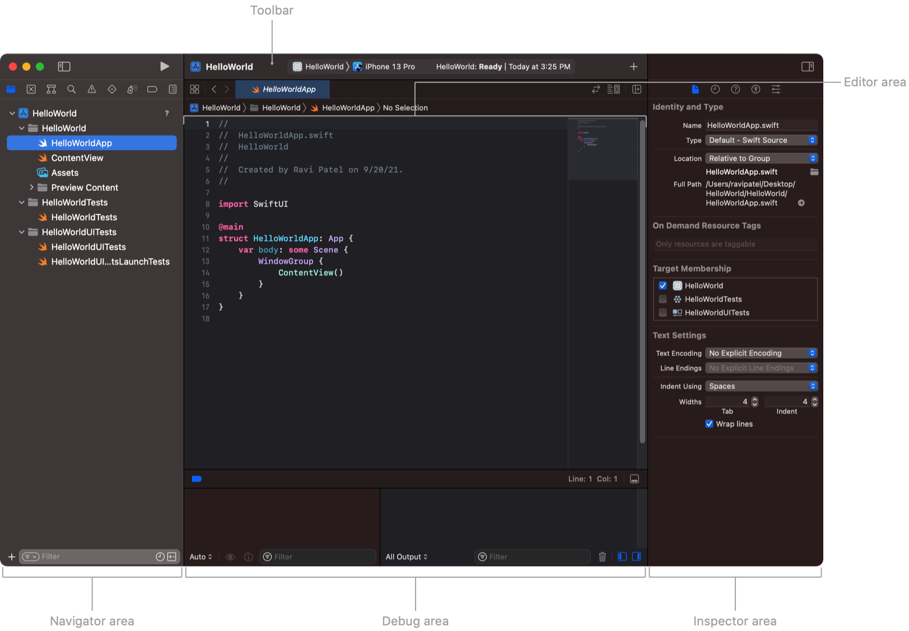
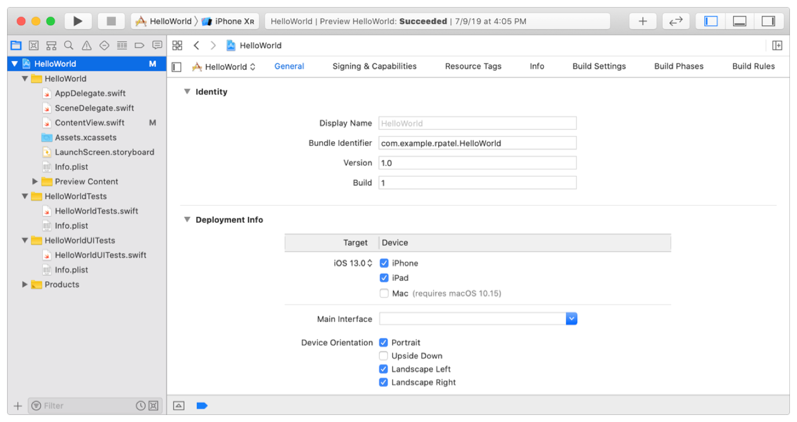
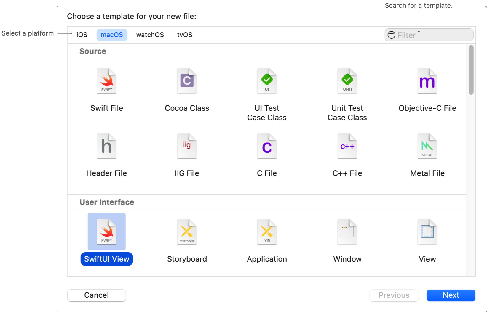

# 🧠 Xcode projects

Xcode is Apple’s integrated development environment (IDE). You use Xcode to build apps for Apple products, including iPad, iPhone, Apple Watch, Apple TV, and Mac. Xcode provides tools to manage your entire development workflow—from creating your app to testing, optimizing, and submitting it to the App Store.

## Xcode Projects

A project keeps the necessary files and resources for developing your app organized. To create a project, start with one of the templates, then modify it however you like. Templates are available for each platform (iOS, watchOS, tvOS, and macOS) and for common types of apps, frameworks, and libraries. Each template comes preconfigured with default settings and is ready to build and run. To see an interactive preview while laying out the interface and editing code, choose Swift as the programming language, and SwiftUI as the user interface.

Before creating a project, collect the following information Xcode will need to create the project:

**Product name** The name of your app as it will appear in the App Store and appear on a device when installed. The product name must be at least 2 characters (unless you have billions of dollars) and no more than 255 bytes, and should be similar to the app name that you enter later in App Store Connect.

**Organization identifier** A reverse DNS string that uniquely identifies your organization. If you don’t have a company identifier, use com.example. followed by your organization name, and replace it before you distribute your app.

**Organization name** The name that appears in boilerplate text throughout your project folder. For example, the source and header file copyright strings contain the organization name. The organization name in your project isn’t the same as the organization name that appears in the App Store.

## Create an iOS Project

Launch Xcode then select 'Create a new Xcode project or choose **File > New > Project**. On the next screen select the template and application and click 'Next'

You must provide a product name and organization identifier because they are used to create the bundle identifier that identifies your app throughout the system. Also enter an organization name. If you don’t belong to an organization, enter your name.

## Main Project Window

The main project window is a collection of configurable panels including:

- **The toolbar**: to build and run your app, view progress of tasks, and configure the main window.
- **The editor area**: for viewing and editing the contents of your project including code, user interface files, property lists, project settings, and more.
- **The navigator area**: for viewing the parts of your project including files, symbols, breakpoints, and build information.
- **The debug area**: for controlling the execution of your app during debugging, and for displaying variables, register, and status information.
- **The inspector area**: for viewing and editing information about the selected object in the navigator or editor area, or the entire project.

## Project Properties

To change properties you entered when creating your project, select the project name in the project navigator that appears at the top, then the project editor opens in the editor area. Most of the properties you entered appear on the General pane of the project editor.

## Manage Files

### Add New Files

Xcode provides templates for the common types of files you might want to add to your project, such as Swift files or playgrounds. In the Project navigator, select the folder or group where you want to add a file and perform one of the following actions:

- Click the Add button (+) in the filter bar and choose File from the pop-up menu.
- Choose New > File.
- Control-click and select New File.

In the new file sheet, select a template for your new file. Xcode organizes templates by type to make them easier to find. You can also use the filter control to search for templates by name. After you select a template, click Next.

### Add Existing Files

[Add Existing Files to a Project - Apple Developer Documentation](https://developer.apple.com/documentation/xcode/managing-files-and-folders-in-your-xcode-project#Add-Existing-Files-and-Folders-to-a-Project)

### Organize Files

[Organize Project Files - Apple Developer Documentation](https://developer.apple.com/documentation/xcode/managing-files-and-folders-in-your-xcode-project#Organize-Project-Files-in-the-Navigator)

## Source Code Annotation

The jump bar and the minimap each provide a quick visual way to navigate your code in the Xcode source editor. Annotate your code with MARK, FIXME, and TODO comments to enhance the power of these tools when organizing your code.

[Annotate Your Code for Visibility](https://developer.apple.com/documentation/xcode/creating-organizing-and-editing-source-files#Annotate-Your-Code-for-Visibility)

## See Also

- [Xcode - Apple Developer Documentation](https://developer.apple.com/documentation/xcode)
