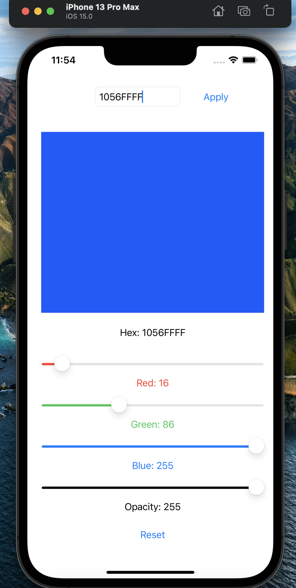

# 🧠 Assignment 1

## RGB Color App

In this assignment you will create an iOS App using Swift and SwiftUI that displays a preview of an 8 bit RGB color.

## App Features

- Individual Slider controls for Red, Green and Blue channels
- Slider control to adjust Alpha/Opacity
- Hexadecimal color code is displayed for easy use in your design and development projects
- Supports Hexadecimal color code input for easy previewing
- Supports 3 and 4 digit CSS style color values (RGB and RGBA)
- Hexadecimal color code input supported for 3, 4,6 and 8 character input
- Keypad input is limited to an 8 character maximum
- Only valid hexadecimal characters can be input from the keypad
- Large preview for accurate color viewing
- Reset button to clear current values
- Screen size detection
- Responsive UI for Landscape screens on smaller iPhone/iPod devices
- iPad screen consistent for Landscape and Portrait

::: danger Important
A demo of this App will be shown in class.
:::

## Requirements

- Separate SubView for the Slider and associated Text Controls
- Separate SubView for the TextView and Apply button Controls
- Separate SubView for the Color Preview (Rectangle and Text) Controls
- Use SizeClasses to create dynamic layouts for portrait and landscape views
- A separate Swift source file for the getRGBAColor method
- getRGBAColor method supports 3 and 4 digit CSS style color values (RGB and RGBA) and 6 and 8 digit - RRGGBB and RRGGBBAA values
- 5 @State property wrappers
- 5 @Binding property wrappers (duplicates also required in SubViews)
- Keypad Input limited to 8 characters
- Keypad Input limited to valid hexadecimal values only
- Apply button disabled when character count is invalid
- Reset button clears all input controls

## User Interface

Add the following controls using SwiftUI:

- A Rectangle View control
- 2 Button View controls
- 4 Slider View controls
- A TextField View input control
- Several HStack and VStack View controls
- Multiple SubViews

## Permissions

No additional permissions are required

## Submission

Submit your assignment as a complete project (containing all source code and support files) that is packaged as zip file that is created in Finder using the "Compress to Zip File" options.

:::danger Important
Rename the zip file so that it includes your first and last name:

example: **john-appleseed-mad9137-assignment1.zip**
:::

