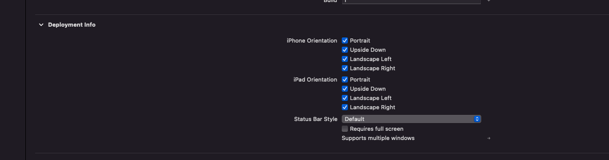

# 🧠 Device Orientation

## Environment wrappers

- Use the `@Environment` wrapper to check various information from a view's environment
- Some values are updated automatically and others are checked on recurring basis
- Can only read SwiftUI values, not set them
- Can create your own property wrappers (we will not cover)
- For the full list of available values, see [EnvironmentValues](https://developer.apple.com/documentation/swiftui/environmentvalues)
- Variables are automatically populated with the wrapped value

```swift
// Declaring a SwiftUI @Environment wrapper
@Environment(\.colorScheme) var colorScheme: ColorScheme
```

## Checking device orientation

- The `horizontalSizeClass` and `verticalSizeClass` key paths can be used to check device orientation
- Each will return either `.compact` or `.regular` values to indicate orientation
- Match these values to the the device size classes as described in [Human Interface Guidelines](https://developer.apple.com/design/human-interface-guidelines/foundations/layout#specifications) to create the logic for determining device orientation
- Note that Apple uses the concept of 'compact' or 'regular' size classes rather than specific device sizes, screen sizes, resolution or device orientation
- To ensure you're considering all devices in your responsive layout, apply the combinations of `.compact` and `.regular` that cover your targeted devices

```swift
struct ContentView: View {
    // declare environment wrappers 
    @Environment(\.horizontalSizeClass) var hSizeClass
    @Environment(\.verticalSizeClass) var vSizeClass

    var body: some View {
         if vSizeClass == .regular && hSizeClass == .compact {
            print("device is probably in portrait orientation")    
        } else {
            print("device is probably in landscape orientation") 
        }
    }
}
```

## Configure an app to honor a specific orientation

Adjust the orientation values under 'deployment info' on the General tab of the project properties.


## See Also

- [@Environment Property Wrapper](https://developer.apple.com/documentation/swiftui/environment)
- [Human Interface Guidelines - Layout](https://developer.apple.com/design/human-interface-guidelines/foundations/layout#guides-and-safe-areas)
